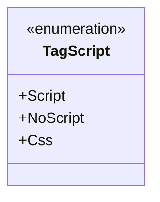

# TagScript

**Namespace**: IsthmusWinthor.Dominio.Enumeradores  
**Nome do Arquivo**: TagScript.cs  

Este enumerador é utilizado para categorizar diferentes tipos de scripts que podem ser aplicados em uma aplicação, oferecendo uma abstração clara sobre as opções disponíveis.

## Tipos Auxiliares e Dependências
- **Enumeradores**:
  - `[TagScript](TagScript.md)`  

## Diagrama de Relacionamentos

