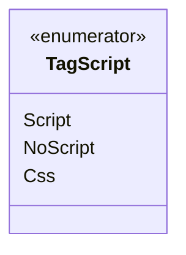

# TagScript

**Namespace**: IsthmusWinthor.Dominio.Enumeradores  
**Nome do Arquivo**: TagScript.cs  

---

O `TagScript` é um enumerador utilizado para categorizar tipos de tags que podem ser usadas em uma aplicação web, definindo assim o comportamento da representação de conteúdo dinâmico ou estático.

## Tipos Auxiliares e Dependências
- **Enumeradores**:
  - `Script`: Indica uma tag de script que contém código executável pelo navegador.
  - `NoScript`: Indica uma tag que se utiliza quando o suporte a script está desabilitado.
  - `Css`: Indica uma tag de estilo que contém definições de layout.

--- 

### Diagrama de Relacionamentos

---
Gerada em 29/12/2025 21:01:50
