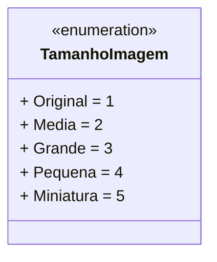

# TamanhoImagem

**Namespace**: IsthmusWinthor.Dominio.Enumeradores  
**Nome do Arquivo**: TamanhoImagem.cs  

O `TamanhoImagem` é um enumerador utilizado para representar os diferentes tamanhos possíveis de uma imagem no sistema, garantindo a padronização e a integridade dos dados relacionados às dimensões das imagens.

## Tipos Auxiliares e Dependências
- Nenhum

## Diagrama de Relacionamentos

---
Gerada em 29/12/2025 21:01:55
