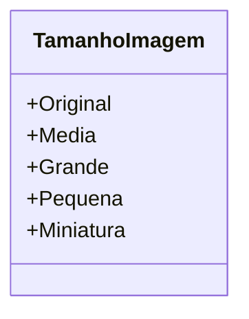

# TamanhoImagem

**Namespace**: IsthmusWinthor.Dominio.Enumeradores  
**Nome do Arquivo**: TamanhoImagem.cs

---

Esta classe representa um enumerador utilizado para especificar os diferentes tamanhos de imagem suportados. O `TamanhoImagem` é fundamental em cenários onde o dimensionamento adequado das imagens é crítico, como na apresentação de conteúdo visual em uma aplicação.

## Tipos Auxiliares e Dependências

- Enumeradores:
  - `[TamanhoImagem](TamanhoImagem.md)`

## Diagrama de Relacionamentos

