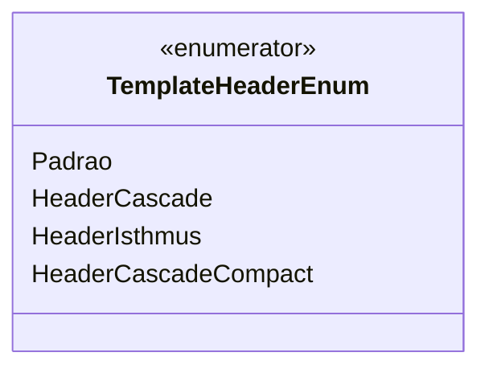

# TemplateHeaderEnum
**Namespace**: IsthmusWinthor.Dominio.Enumeradores  
**Nome do Arquivo**: TemplateHeaderEnum.cs  

Este enumerador define os diferentes tipos de cabeçalhos de template utilizados na aplicação, facilitando o gerenciamento e a consistência dos menus utilizados na interface de usuário.

## Tipos Auxiliares e Dependências
- [DescriptionAttribute](https://docs.microsoft.com/dotnet/api/system.componentmodel.descriptionattribute) - Usado para adicionar descrições aos membros do enum.

## Diagrama de Relacionamentos

---
Gerada em 29/12/2025 21:01:58
