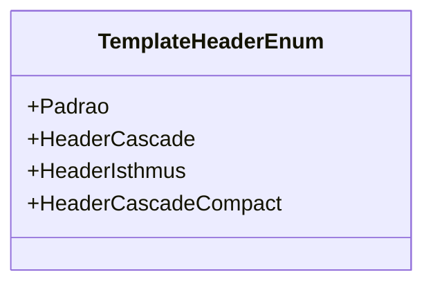

# TemplateHeaderEnum

**Namespace**: IsthmusWinthor.Dominio.Enumeradores  
**Nome do Arquivo**: TemplateHeaderEnum.cs  

O `TemplateHeaderEnum` define os diferentes tipos de cabeçalhos de menu utilizados na aplicação, facilitando a identificação e a utilização de estilos de interface específicos em várias partes do sistema.

## Tipos Auxiliares e Dependências

- **Enumeradores**:
  - `[TemplateHeaderEnum](TemplateHeaderEnum.md)`: Define os diferentes tipos de cabeçalhos.

## Diagrama de Relacionamentos

