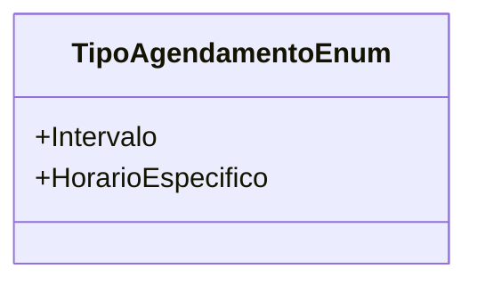

# TipoAgendamentoEnum
**Namespace**: IsthmusWinthor.Dominio.Enumeradores  
**Nome do Arquivo**: TipoAgendamentoEnum.cs  

Este enum é utilizado para definir os tipos de agendamentos disponíveis no sistema, facilitando a categorização e identificação dos mesmos.

## Tipos Auxiliares e Dependências
- **Enumeradores**:
  - `[TipoAgendamentoEnum](TipoAgendamentoEnum.md)`

## Diagrama de Relacionamentos

