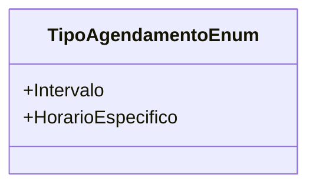

# TipoAgendamentoEnum
**Namespace**: IsthmusWinthor.Dominio.Enumeradores  
**Nome do Arquivo**: TipoAgendamentoEnum.cs  

Esta classe é um enumerador que define os tipos de agendamento utilizados no sistema, garantindo a integridade e legibilidade dos valores de agendamento.

## Tipos Auxiliares e Dependências
- **TipoAgendamentoEnum**: Este é o próprio enumerador que representa as opções de agendamento.
  
## Diagrama de Relacionamentos

---
Gerada em 29/12/2025 21:02:02
