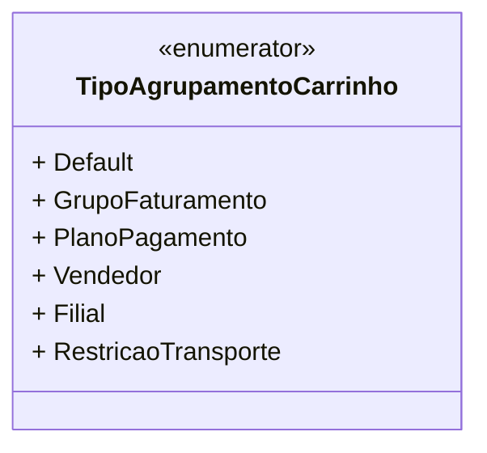

# TipoAgrupamentoCarrinho
**Namespace**: IsthmusWinthor.Dominio.Enumeradores  
**Nome do Arquivo**: TipoAgrupamentoCarrinho.cs  

O `TipoAgrupamentoCarrinho` é um enumerador que define diferentes modos de agrupamento para itens em um carrinho de compras dentro do sistema, permitindo gerenciar as regras de negócios associadas ao processo de faturamento e restrições de pagamento.

## Métodos de Negócio
Nenhum método com lógica de negócio foi encontrado neste enumerador, pois trata-se apenas de um agrupamento de valores constantes.

## Propriedades Calculadas e de Validação
Não há propriedades calculadas ou de validação neste enumerador, uma vez que se trata de um conjunto de constantes.

## Navigations Property
Não existem propriedades de navegação a serem listadas, pois o `TipoAgrupamentoCarrinho` não contém associações complexas.

## Tipos Auxiliares e Dependências
Não há enumeradores ou classes auxiliares utilizadas diretamente dentro deste enumerador, mas ele pode ser considerado por outros componentes que utilizem agrupamentos em carrinhos.

## Diagrama de Relacionamentos

