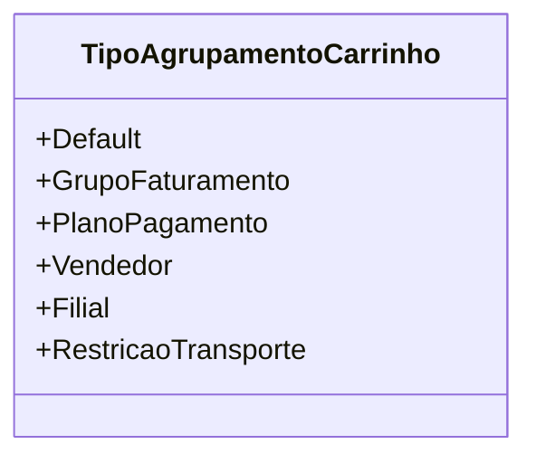

# TipoAgrupamentoCarrinho
**Namespace**: IsthmusWinthor.Dominio.Enumeradores  
**Nome do Arquivo**: TipoAgrupamentoCarrinho.cs  

TipoAgrupamentoCarrinho é um enumerador que define os diferentes tipos de agrupamento que podem ser aplicados ao carrinho de compras. Ele serve como um suporte para a lógica de agrupamento de itens com base em diversas regras de negócio relevantes durante o processo de faturamento e restrição de planos de pagamento.

## Tipos Auxiliares e Dependências
- Nenhum enumerador ou classe estática adicional é utilizada nesta classe.

## Diagrama de Relacionamentos

---
Gerada em 29/12/2025 21:02:07
