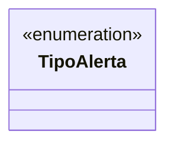

# TipoAlerta

**Namespace**: IsthmusWinthor.Dominio.Enumeradores  
**Nome do Arquivo**: TipoAlerta.cs  

## Visão Geral e Responsabilidade
A enumeração `TipoAlerta` representa diferentes tipos de alertas que podem ser gerados no sistema. Cada alerta é uma notificação sobre eventos ou situações específicas, como problemas de integração de pedidos ou falhas na conciliação de pagamentos. Esses alertas são fundamentais para o monitoramento de operações e ajudam os usuários a agir rapidamente diante de problemas críticos.

## Métodos de Negócio
A enumeração em si não contém métodos de negócio com lógica, pois serve apenas como um contêiner de constantes.

## Propriedades Calculadas e de Validação
Não há propriedades com lógica de cálculo ou validação na enumeração.

## Navigations Property
Não existem propriedades complexas do domínio nesta enumeração, pois ela é composta apenas por valores enumerados.

## Tipos Auxiliares e Dependências
- Nenhum enumerador ou classe auxiliar externa é utilizada diretamente nessa enumeração.

## Diagrama de Relacionamentos

Esta documentação fornece uma visão clara sobre os tipos de alertas que o sistema pode gerar, garantindo que a equipe de desenvolvimento e os stakeholders entendam as opções disponíveis e suas aplicações.
