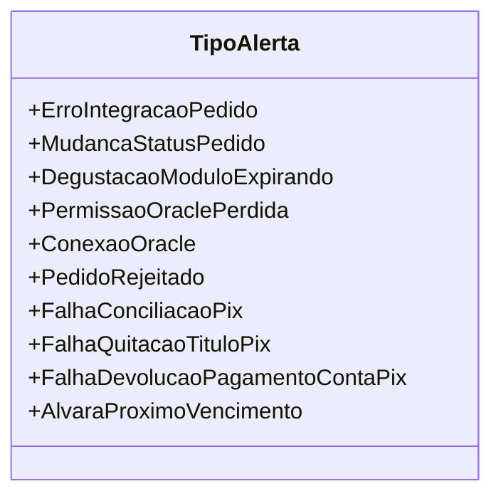

# TipoAlerta

**Namespace**: IsthmusWinthor.Dominio.Enumeradores  
**Nome do Arquivo**: TipoAlerta.cs  

## Visão Geral e Responsabilidade
A classe `TipoAlerta` é um enumerador que representa diferentes tipos de alertas gerados pelo sistema. Seu objetivo é fornecer uma forma padronizada de categorizar mensagens de alerta importantes relacionadas a integrações de pedidos, problemas de conexão, e avisos sobre status de operações financeiras como transações via PIX. Assim, auxilia na manutenção de um sistema mais robusto e na comunicação eficaz dos eventos críticos aos usuários e sistemas integrados.

## Métodos de Negócio
Essa classe não contém métodos com lógica complexa, sendo um enumerador simples.

## Propriedades Calculadas e de Validação
Essa classe não possui propriedades calculadas ou de validação. Todos os valores são constantes, derivados do padrão do enum.

## Navigations Property
Esta classe não possui Navegação para propriedades complexas do domínio.

## Tipos Auxiliares e Dependências
- Nenhum enumerador ou classe auxiliar é utilizado por `TipoAlerta`.

## Diagrama de Relacionamentos

---
Gerada em 29/12/2025 21:02:16
