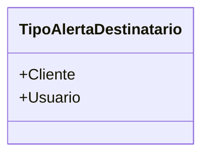

# TipoAlertaDestinatario
**Namespace**: IsthmusWinthor.Dominio.Enumeradores  
**Nome do Arquivo**: TipoAlertaDestinatario.cs  

Este enumerador define os tipos de destinatários de alertas no sistema, esclarecendo se o alerta é destinado a um Cliente ou a um Usuário. 

## Tipos Auxiliares e Dependências
- `TipoAlertaDestinatario`

## Diagrama de Relacionamentos

