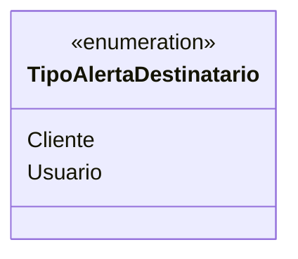

# TipoAlertaDestinatario
**Namespace**: IsthmusWinthor.Dominio.Enumeradores  
**Nome do Arquivo**: TipoAlertaDestinatario.cs  

O `TipoAlertaDestinatario` é um enumerador que define os tipos de destinatários para alertas no sistema. Ele especifica as categorizações possíveis para os destinatários, facilitando a identificação e manuseio de notificações destinadas a diferentes perfis de usuários.

## Tipos Auxiliares e Dependências
- Enumeradores:
  - [TipoAlertaDestinatario](TipoAlertaDestinatario.md) 

## Diagrama de Relacionamentos

---
Gerada em 29/12/2025 21:02:21
