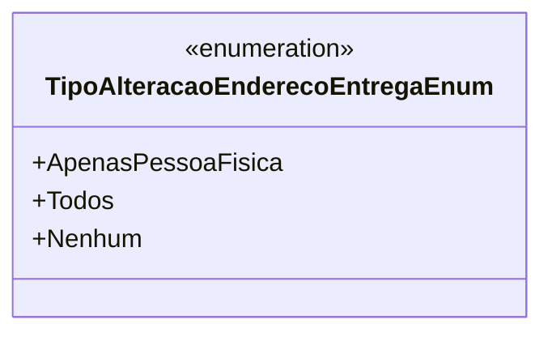

# TipoAlteracaoEnderecoEntregaEnum
**Namespace**: IsthmusWinthor.Dominio.Enumeradores  
**Nome do Arquivo**: TipoAlteracaoEnderecoEntregaEnum.cs  

O `TipoAlteracaoEnderecoEntregaEnum` é um enumerador utilizado para definir os diferentes tipos de alteração que podem ser aplicados ao endereço de entrega. Ele fornece uma forma estruturada de representar as opções disponíveis, facilitando a aplicação de regras de negócio relacionadas ao envio de produtos.

### Tipos Auxiliares e Dependências
- **Enums**
  - [TipoAlteracaoEnderecoEntregaEnum](TipoAlteracaoEnderecoEntregaEnum.md) 

### Diagrama de Relacionamentos

---
Gerada em 29/12/2025 21:02:26
