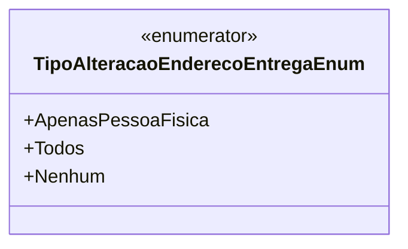

# TipoAlteracaoEnderecoEntregaEnum
**Namespace**: IsthmusWinthor.Dominio.Enumeradores  
**Nome do Arquivo**: TipoAlteracaoEnderecoEntregaEnum.cs  

Este enumerador é utilizado para definir as diferentes permissões de alteração do endereço de entrega. As opções disponíveis permitem que o sistema gerencie quem pode alterar as informações de entrega, garantindo uma correta aplicação das regras de negócio relacionadas a esse contexto.

## Tipos Auxiliares e Dependências
- Nenhuma classe complexa ou propriedade de navegação, pois é um enumerador simples.

### Enumeradores
- `[TipoAlteracaoEnderecoEntregaEnum](TipoAlteracaoEnderecoEntregaEnum.md)`: Define as opções de alteração de endereço de entrega:
  - `ApenasPessoaFisica`: Permite a alteração apenas por pessoas físicas.
  - `Todos`: Permite a alteração por todos os tipos de usuários.
  - `Nenhum`: Não permite nenhuma alteração.

## Diagrama de Relacionamentos

