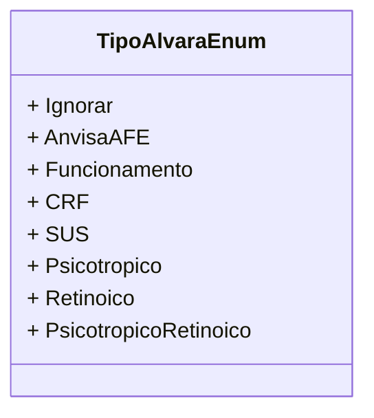

# TipoAlvaraEnum
**Namespace**: IsthmusWinthor.Dominio.Enumeradores  
**Nome do Arquivo**: TipoAlvaraEnum.cs  

O `TipoAlvaraEnum` é um enumerador que define os diferentes tipos de alvarás usados no sistema. Sua finalidade é categorizar e padronizar os tipos de alvarás que podem ser atribuídos a diferentes entidades no domínio, facilitando a validação e a manipulação desses dados nas regras de negócio.

## Tipos Auxiliares e Dependências
- Nenhum.

## Diagrama de Relacionamentos

