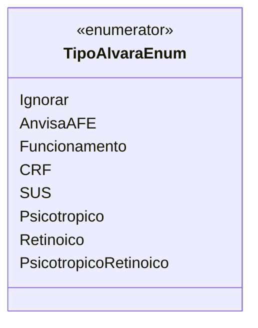

# TipoAlvaraEnum
**Namespace**: IsthmusWinthor.Dominio.Enumeradores  
**Nome do Arquivo**: TipoAlvaraEnum.cs  

Este é um enumerador que representa os diferentes tipos de alvarás que podem ser utilizados dentro do sistema. Ele é fundamental para garantir a tipificação correta dos alvarás em diversas operações de negócio, proporcionando clareza e integridade na manipulação desses dados.

## Tipos Auxiliares e Dependências
- Nenhuma classe complexa ou navigations property associada.
  
### Enumeradores
- [TipoAlvaraEnum](TipoAlvaraEnum.md)

## Diagrama de Relacionamentos

A classe `TipoAlvaraEnum` fornece uma lista de possíveis tipos de alvarás, cada um acompanhado de uma descrição que explica seu propósito específico. Essa estrutura permite que o sistema trate diferentes tipos de alvarás de forma organizada e segura.
---
Gerada em 29/12/2025 21:02:33
