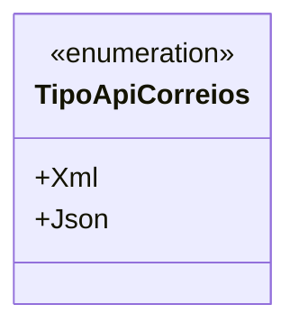

# TipoApiCorreios
**Namespace**: IsthmusWinthor.Dominio.Enumeradores  
**Nome do Arquivo**: TipoApiCorreios.cs  

O `TipoApiCorreios` é um enumerador que define os tipos de formatos aceitos na comunicação com a API dos Correios, sendo uma parte vital na configuração de métodos que precisam especificar o formato de resposta esperado (XML ou JSON).

### Tipos Auxiliares e Dependências
- **Enum**:
  - [TipoApiCorreios](TipoApiCorreios.md) - Enumeração que lista os tipos de formato aceitos pela API dos Correios.

### Diagrama de Relacionamentos

---
Gerada em 29/12/2025 21:02:38
