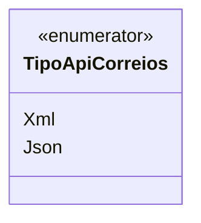

# TipoApiCorreios
**Namespace**: IsthmusWinthor.Dominio.Enumeradores  
**Nome do Arquivo**: TipoApiCorreios.cs  

O `TipoApiCorreios` é um enumerador que define os tipos de formato de resposta que podem ser utilizados ao interagir com a API dos Correios. Ele é essencial para garantir que os serviços que dependem da comunicação com essa API manipulem respostas no formato adequado, seja em XML ou JSON.

## Tipos Auxiliares e Dependências
- `TipoApiCorreios` (Enumerador utilizado para especificar o formato da API de integração com os Correios).

