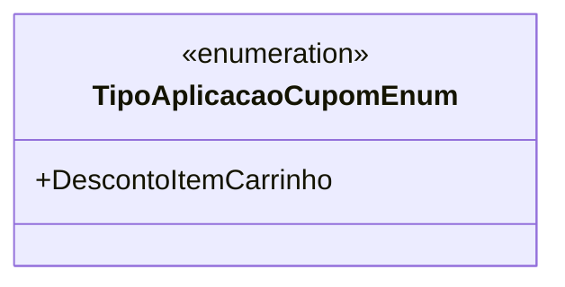

# TipoAplicacaoCupomEnum
**Namespace**: IsthmusWinthor.Dominio.Enumeradores  
**Nome do Arquivo**: TipoAplicacaoCupomEnum.cs  

Esse enumerador define os tipos de aplicação de cupons, particularmente as regras específicas que determinam como o desconto é aplicado em compras.

## Tipos Auxiliares e Dependências
- **Enumeradores**:
  - [TipoAplicacaoCupomEnum](TipoAplicacaoCupomEnum.md) 

---

### Diagrama de Relacionamentos

---
Gerada em 29/12/2025 21:02:43
