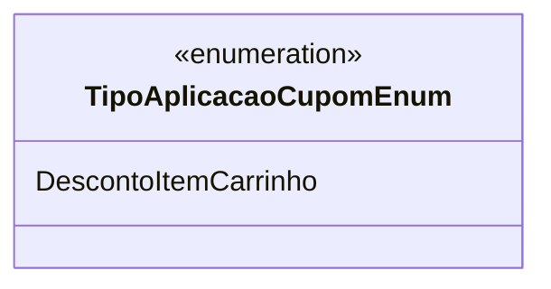

# TipoAplicacaoCupomEnum
**Namespace**: IsthmusWinthor.Dominio.Enumeradores  
**Nome do Arquivo**: TipoAplicacaoCupomEnum.cs  

Este enum é utilizado para definir os tipos de aplicação de um cupom, fornecendo um conjunto padronizado de opções que podem ser utilizadas em um sistema de e-commerce. É uma ferramenta crucial para garantir a consistência na aplicação de descontos e promoções.

## Tipos Auxiliares e Dependências
- Nenhum tipo auxiliar adicional ou dependência externa é utilizado.

## Diagrama de Relacionamentos

