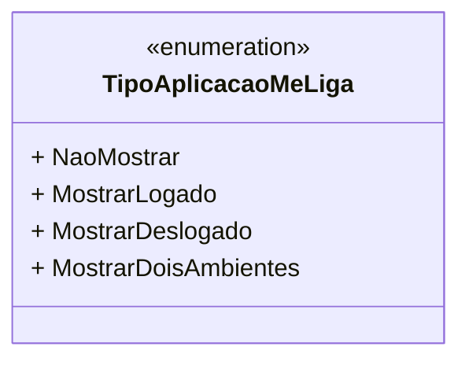

# TipoAplicacaoMeLiga
**Namespace**: IsthmusWinthor.Dominio.Enumeradores  
**Nome do Arquivo**: TipoAplicacaoMeLiga.cs  

Este é um enumerador que define os diferentes tipos de aplicação que podem ser utilizados no contexto do sistema, permitindo uma gestão eficaz das exibições de informações com base no estado de login do usuário.

## Tipos Auxiliares e Dependências
- Enumerator: [TipoAplicacaoMeLiga](TipoAplicacaoMeLiga.md)

## Diagrama de Relacionamentos

---
Gerada em 29/12/2025 21:02:48
