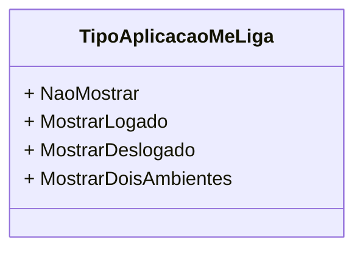

# TipoAplicacaoMeLiga
**Namespace**: IsthmusWinthor.Dominio.Enumeradores  
**Nome do Arquivo**: TipoAplicacaoMeLiga.cs  

`TipoAplicacaoMeLiga` é um enumerador que define os diferentes estados de visibilidade para uma aplicação chamada "MeLiga". Ele é utilizado para controlar qual conjunto de informações é apresentado ao usuário com base no estado de autenticação e configuração da aplicação.

---

## Tipos Auxiliares e Dependências
- **Enumerador**: 
  - `[TipoAplicacaoMeLiga](TipoAplicacaoMeLiga.md)`

## Diagrama de Relacionamentos

