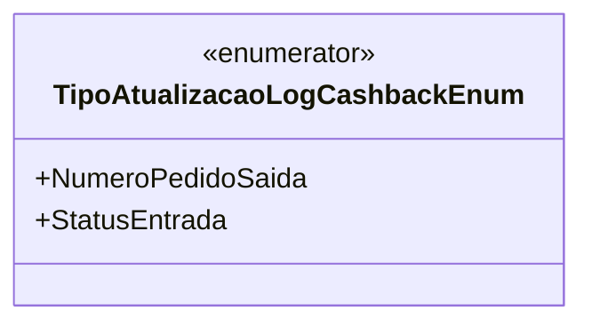

# TipoAtualizacaoLogCashbackEnum
**Namespace**: IsthmusWinthor.Dominio.Enumeradores  
**Nome do Arquivo**: TipoAtualizacaoLogCashbackEnum.cs  

## Visão Geral e Responsabilidade
O `TipoAtualizacaoLogCashbackEnum` é um enumerador que define os diferentes tipos de atualizações que podem ser registradas no log referente ao cashback dentro do sistema. Este tipo é útil para categorizar e identificar rapidamente a natureza da atualização, facilitando a manutenção e auditoria dos logs de cashback.

## Tipos Auxiliares e Dependências
- **Enumeradores**:
  - `TipoAtualizacaoLogCashbackEnum`
  
## Diagrama de Relacionamentos

---
Gerada em 29/12/2025 21:02:54
