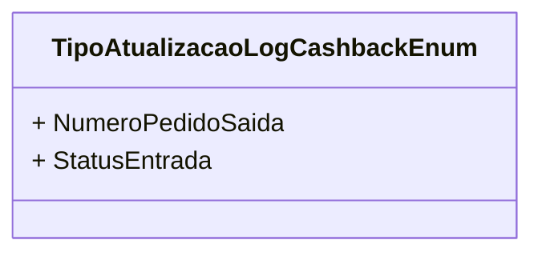

# TipoAtualizacaoLogCashbackEnum
**Namespace**: IsthmusWinthor.Dominio.Enumeradores  
**Nome do Arquivo**: TipoAtualizacaoLogCashbackEnum.cs  

O `TipoAtualizacaoLogCashbackEnum` é um enumerador que define os diferentes tipos de atualizações que podem ser registradas em um log de cashback. Este enumerador é fundamental para a categorização e controle das alterações que ocorrem nos registros relacionados a cashback, garantindo que o sistema possa identificar rapidamente a natureza da atualização ao processar ou analisar logs.

### Tipos Auxiliares e Dependências
- **Nenhum**.

### Diagrama de Relacionamentos

