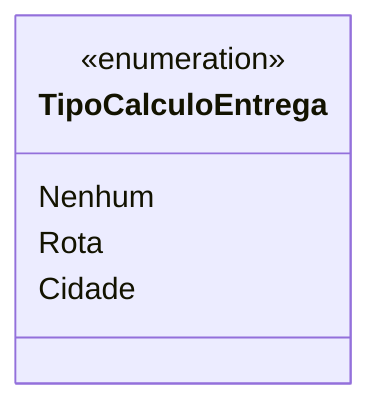

# TipoCalculoEntrega
**Namespace**: IsthmusWinthor.Dominio.Enumeradores  
**Nome do Arquivo**: TipoCalculoEntrega.cs  

`TipoCalculoEntrega` é um enumerador que define os tipos de cálculo de entrega disponíveis no sistema. Ele é utilizado para modularizar e controlar a lógica relacionada ao planejamento de entregas, permitindo que o sistema escolha diferentes estratégias de cálculo com base na natureza da entrega.

## Tipos Auxiliares e Dependências
- Enumeradores utilizados:
  - `[TipoCalculoEntrega](TipoCalculoEntrega.md)`

## Diagrama de Relacionamentos

