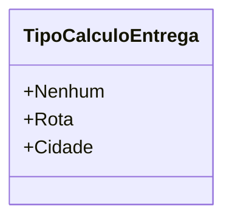

# TipoCalculoEntrega
**Namespace**: IsthmusWinthor.Dominio.Enumeradores  
**Nome do Arquivo**: TipoCalculoEntrega.cs  

O `TipoCalculoEntrega` é um enumerador que define os diferentes tipos de cálculo disponíveis para a entrega de produtos. Este enum é fundamental para o sistema, pois permite ao negócio distinguir entre diferentes métodos de entrega, garantindo assim uma maior flexibilidade e controle sobre as operações de logística.

## Tipos Auxiliares e Dependências
- Classes Utilizadas: Não há dependências de classes complexas.  
- Enumeradores:
  - [TipoCalculoEntrega](TipoCalculoEntrega.md)  

## Diagrama de Relacionamentos

---
Gerada em 29/12/2025 21:02:59
