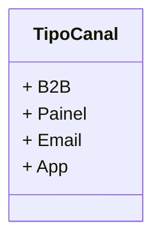

# TipoCanal
**Namespace**: IsthmusWinthor.Dominio.Enumeradores  
**Nome do Arquivo**: TipoCanal.cs  

O `TipoCanal` é um enumerador que define os tipos de canais de comunicação disponíveis no sistema. Ele é utilizado para categorizar as interações do usuário ou de negócios nas diferentes plataformas.

## Tipos Auxiliares e Dependências
- Nenhuma classe complexa do domínio.
- Dependências:
  - Nenhum.

## Diagrama de Relacionamentos

