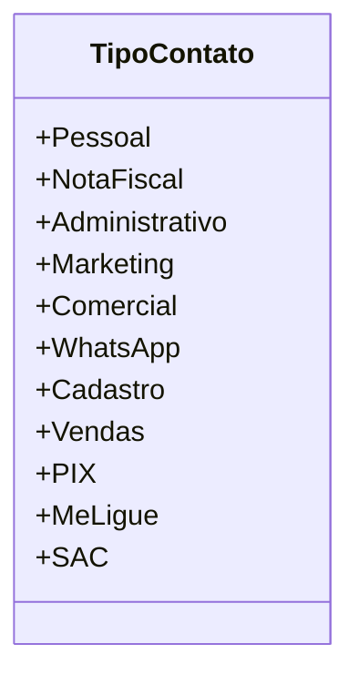

# TipoContato
**Namespace**: IsthmusWinthor.Dominio.Enumeradores  
**Nome do Arquivo**: TipoContato.cs  

Este enumerador define os tipos de contato que podem ser utilizados dentro do sistema, permitindo a categorização e o tratamento específico de diferentes canais de comunicação.

## Métodos de Negócio
- **Título**: Não aplicável  
- **Objetivo**: Este enumerador serve para tipificar os contatos dentro do sistema, oferecendo um controle de categorização que pode ser utilizado nas regras de negócio associadas à comunicação com o cliente e à gestão de diferentes interações.

### Propriedades Calculadas e de Validação
- Não há propriedades com lógica de cálculo ou validação, uma vez que este é um enumerador simples.

### Navigation Property
- Não há propriedades de navegação disponíveis.

### Tipos Auxiliares e Dependências
- Não há tipos auxiliares diretamente utilizados por esta classe.

## Diagrama de Relacionamentos

