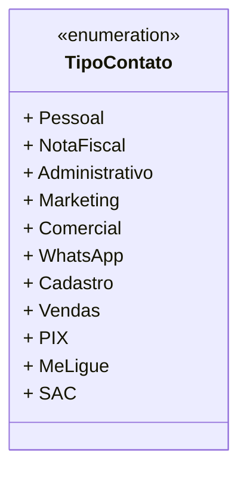

# TipoContato
**Namespace**: IsthmusWinthor.Dominio.Enumeradores   
**Nome do Arquivo**: TipoContato.cs  

`TipoContato` é uma enumeração que define os tipos de contatos utilizados no sistema, facilitando a categorização e padronização dos diferentes tipos de interação que os usuários podem ter com o sistema, tais como contatos para vendas, atendimento ao cliente, entre outros.

---

## Tipos Auxiliares e Dependências
- Nenhum tipo auxiliar, enumerador ou classe estática adicional utilizado além da própria enumeração.

---

## Diagrama de Relacionamentos

---
Gerada em 29/12/2025 21:03:09
