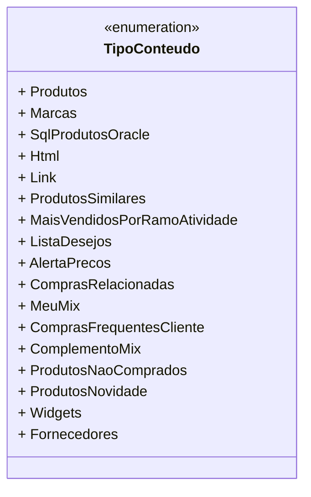

# TipoConteudo

**Namespace**: IsthmusWinthor.Dominio.Enumeradores  
**Nome do Arquivo**: TipoConteudo.cs  

### Visão Geral e Responsabilidade
A classe `TipoConteudo` é um enumerador que categoriza diferentes tipos de conteúdo que podem ser exibidos ou gerenciados em um sistema de e-commerce ou gestão de produtos. Este enumerador é crucial para garantir que o sistema é capaz de identificar e manipular variados tipos de conteúdo de forma estruturada, assegurando que os dados exibidos respeitam a semântica do contexto de uso (por exemplo, produtos, marcas, listas de desejos, entre outros). O uso adequado do enum ajuda a evitar erros de tipo e melhora a legibilidade do código.

### Métodos de Negócio
Neste caso, a classe `TipoConteudo` não possui métodos de negócio, pois é um simples enumerador que serve para classificação de tipos de conteúdo sem lógica complexa. Portanto, não há métodos a serem detalhados nesta seção.

### Propriedades Calculadas e de Validação
Na classe `TipoConteudo`, não existem propriedades que exigem cálculos ou validações, visto que se trata de um enumerador.

### Navigations Property
A classe não possui propriedades de navegação, pois é um enumerador simples. 

### Tipos Auxiliares e Dependências
- Esta classe depende de componentes do namespace `System.ComponentModel.DataAnnotations` para fornecer a funcionalidade de exibição de nomes personalizados através da annotation `Display`.

### Diagrama de Relacionamentos

