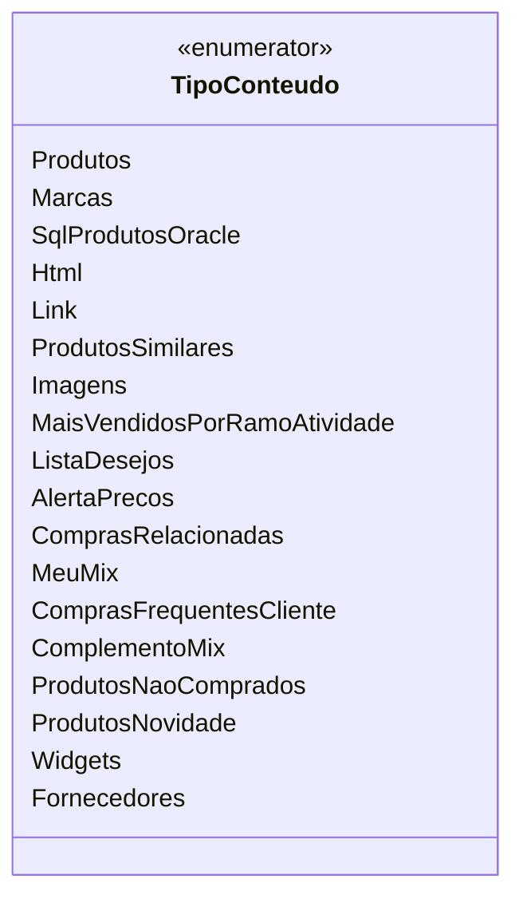

# TipoConteudo

**Namespace**: IsthmusWinthor.Dominio.Enumeradores  
**Nome do Arquivo**: TipoConteudo.cs

## Visão Geral e Responsabilidade
A classe `TipoConteudo` é um enumerador que define os diferentes tipos de conteúdo disponíveis no sistema. Sua principal responsabilidade é catalogar e categorizar conteúdos que podem ser exibidos em uma interface de usuário ou processados por serviços do sistema. Essa classificação é essencial para garantir que os dados sejam apresentados adequadamente e que as operações relacionadas ao conteúdo sejam realizadas de forma consistente e lógica.

## Métodos de Negócio

Neste caso, o `TipoConteudo` é um enumerador e, portanto, não contém métodos de negócio que implementem lógica complexa.

## Propriedades Calculadas e de Validação

Neste caso, não há propriedades calculadas ou de validação, pois `TipoConteudo` é um enumerador que contém valores fixos sem lógica de cálculo ou validação subjacente.

## Navigations Property

Neste caso, não existem propriedades de navegação, pois `TipoConteudo` é um enumerador e não contém referências a outras classes.

## Tipos Auxiliares e Dependências

- Não há dependências de tipos auxiliares diretos dentro de `TipoConteudo`, pois ele é um enumerador autônomo.

## Diagrama de Relacionamentos

---
Gerada em 29/12/2025 21:03:20
