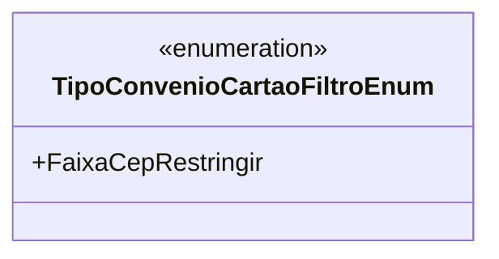

# TipoConvenioCartaoFiltroEnum
**Namespace**: IsthmusWinthor.Dominio.Enumeradores  
**Nome do Arquivo**: TipoConvenioCartaoFiltroEnum.cs  

O `TipoConvenioCartaoFiltroEnum` é um enumerador que tem como finalidade categorizar os diferentes filtros que podem ser aplicados em convênios de cartão no sistema. Este enum permite que valores específicos sejam descritos de maneira legível, facilitando a aplicação dessas categorizations em regras de negócio e validação de dados.

## Tipos Auxiliares e Dependências
- Nenhum.

## Diagrama de Relacionamentos

