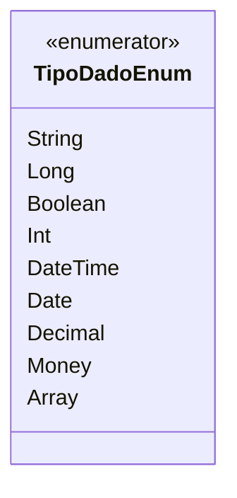

# TipoDadoEnum

**Namespace**: IsthmusWinthor.Dominio.Enumeradores  
**Nome do Arquivo**: TipoDadoEnum.cs

Este enumerador é utilizado para categorizar os tipos de dados que podem ser manipulados dentro do sistema, facilitando a validação e a eficiência no tratamento de diferentes formatos de entrada e saída de dados.

## Tipos Auxiliares e Dependências
- **Enum**:  
  - [TipoDadoEnum](TipoDadoEnum.md): Enum que categoriza diferentes tipos de dados utilizados no sistema.

## Diagrama de Relacionamentos

---
Gerada em 29/12/2025 21:03:27
