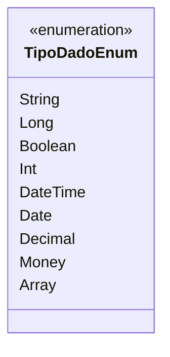

# TipoDadoEnum
**Namespace**: IsthmusWinthor.Dominio.Enumeradores  
**Nome do Arquivo**: TipoDadoEnum.cs  

TipoDadoEnum é uma enumeração que define os tipos de dados suportados em um sistema, atuando como uma referência padrão para o tratamento de diferentes formatos de dados. Sua principal finalidade é garantir a integridade e a coerência na manipulação de dados dentro da aplicação.

## Tipos Auxiliares e Dependências
- TipoDadoEnum: Enumeração que lista tipos de dados com os seguintes valores:
  - `String`: Representa texto.
  - `Long`: Representa um número longo.
  - `Boolean`: Representa um valor verdadeiro ou falso.
  - `Int`: Representa um número inteiro.
  - `DateTime`: Representa data e hora.
  - `Date`: Representa uma data (sem tempo).
  - `Decimal`: Representa um número decimal.
  - `Money`: Representa um valor monetário.
  - `Array`: Representa uma coleção de valores.

## Diagrama de Relacionamentos

