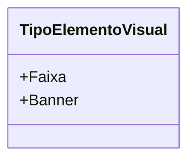

# TipoElementoVisual
**Namespace**: IsthmusWinthor.Dominio.Enumeradores  
**Nome do Arquivo**: TipoElementoVisual.cs  

O `TipoElementoVisual` é um enumerador que tipifica os diferentes tipos de elementos visuais utilizados na aplicação, facilitando a categorização e utilização desses elementos em diferentes contextos de visualização.

## Tipos Auxiliares e Dependências
- Enumeradores:
  - [TipoElementoVisual](TipoElementoVisual.md)

## Diagrama de Relacionamentos

---
Gerada em 29/12/2025 21:03:31
