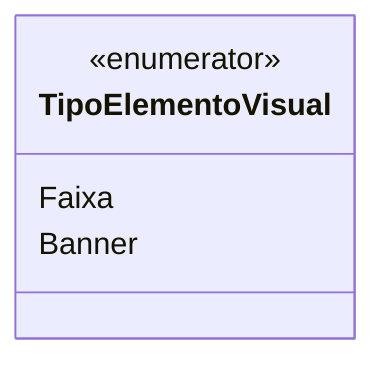

# TipoElementoVisual
**Namespace**: IsthmusWinthor.Dominio.Enumeradores  
**Nome do Arquivo**: TipoElementoVisual.cs  

O `TipoElementoVisual` é um enumerador que representa os diferentes tipos de elementos visuais que podem ser utilizados em um sistema. Ele facilita a categorização e a gestão dos elementos visuais apresentados na interface do usuário, assegurando que cada elemento esteja dentro de uma definição clara e especificada.

## Tipos Auxiliares e Dependências
- **Enumeradores**: 
  - `[TipoElementoVisual](TipoElementoVisual.md)`

## Diagrama de Relacionamentos

