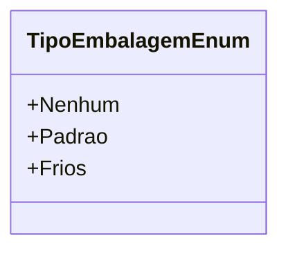

# TipoEmbalagemEnum
- **Namespace**: IsthmusWinthor.Dominio.Enumeradores
- **Nome do Arquivo**: TipoEmbalagemEnum.cs

O `TipoEmbalagemEnum` é um enumerador que define os tipos de embalagem disponíveis na plataforma, permitindo a categorização e manipulação dos diferentes tipos de embalagem usados nos processos de logística e gestão de produtos.

## Tipos Auxiliares e Dependências
- Nenhum

## Diagrama de Relacionamentos

