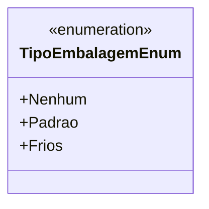

# TipoEmbalagemEnum
**Namespace**: IsthmusWinthor.Dominio.Enumeradores  
**Nome do Arquivo**: TipoEmbalagemEnum.cs  

Esta enumeração define os tipos de embalagem utilizados na plataforma, permitindo a categorização e a identificação de diferentes tipos de embalagem.

## Tipos Auxiliares e Dependências
- Nenhum

## Diagrama de Relacionamentos

---
Gerada em 29/12/2025 21:03:35
