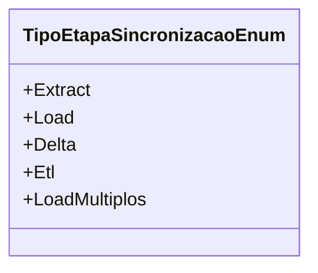

# TipoEtapaSincronizacaoEnum
**Namespace**: IsthmusWinthor.Dominio.Enumeradores  
**Nome do Arquivo**: TipoEtapaSincronizacaoEnum.cs  

Esta enumeração é utilizada para categorizar as etapas de sincronização, facilitando o entendimento e o controle sobre o fluxo de dados em um sistema de ETL (Extract, Transform, Load).

## Tipos Auxiliares e Dependências
- **Enumeradores**:
  - `[TipoEtapaSincronizacaoEnum](TipoEtapaSincronizacaoEnum.md)`

## Diagrama de Relacionamentos

