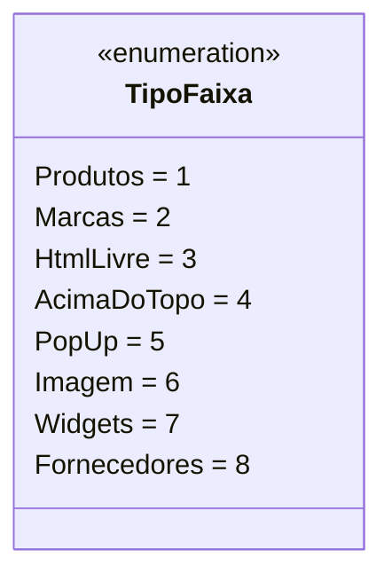

# TipoFaixa
**Namespace**: IsthmusWinthor.Dominio.Enumeradores  
**Nome do Arquivo**: TipoFaixa.cs  

O `TipoFaixa` é um enumerador que categoriza diferentes tipos de faixas de produtos, marcas, e outros elementos visuais que podem ser montados em uma plataforma. Cada valor do enum possui uma descrição que detalha a função da faixa, permitindo que o sistema utilize esses tipos de forma adequada em sua lógica de negócios.

## Tipos Auxiliares e Dependências
- Nenhum tipo auxiliar ou dependência adicional é utilizado nesta classe.

## Diagrama de Relacionamentos

---
Gerada em 29/12/2025 21:03:44
