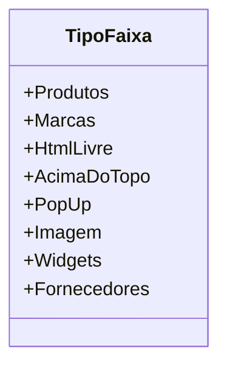

# TipoFaixa
**Namespace**: IsthmusWinthor.Dominio.Enumeradores  
**Nome do Arquivo**: TipoFaixa.cs  

O `TipoFaixa` é um enumerador que define diferentes categorias de faixas utilizadas na plataforma, permitindo uma organização e classificação eficaz dos elementos apresentados na interface do usuário.

## Tipos Auxiliares e Dependências
- Nenhum.

## Diagrama de Relacionamentos

