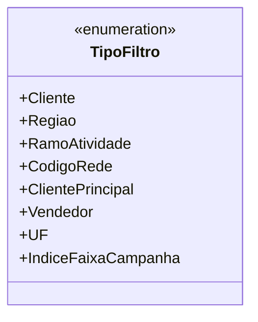

# TipoFiltro

**Namespace**: IsthmusWinthor.Dominio.Enumeradores  
**Nome do Arquivo**: TipoFiltro.cs  

O `TipoFiltro` é um enumerador que define os diferentes tipos de filtros que podem ser aplicados em um contexto de consulta ou relatório, permitindo uma categorização eficiente dos dados que serão trabalhados.

## Tipos Auxiliares e Dependências
- N/A (Nenhuma classe ou tipo auxiliar é diretamente dependente da classe `TipoFiltro`, além dos próprios valores enumerados).

## Diagrama de Relacionamentos

---
Gerada em 29/12/2025 21:03:49
