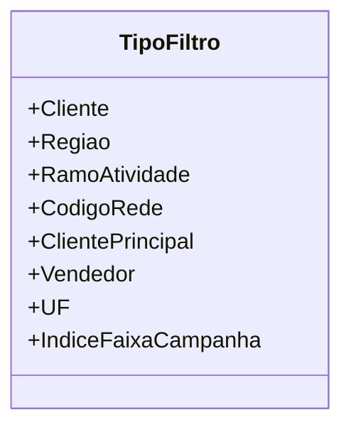

# TipoFiltro

**Namespace**: IsthmusWinthor.Dominio.Enumeradores  
**Nome do Arquivo**: TipoFiltro.cs

O `TipoFiltro` é um enumerador que define diferentes tipos de filtros utilizados no sistema, permitindo a categorização e seleção de dados de forma sistemática e organizada. Ele é amplamente utilizado em operações de busca e filtragem de registros, contribuindo para a eficiência e precisão da manipulação dos dados.

### Tipos Auxiliares e Dependências
- Nenhum tipo auxiliar ou classe estática adicional é necessário para a operação deste enumerador.

### Diagrama de Relacionamentos

