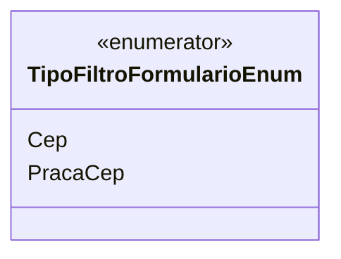

# TipoFiltroFormularioEnum
**Namespace**: IsthmusWinthor.Dominio.Enumeradores  
**Nome do Arquivo**: TipoFiltroFormularioEnum.cs  

TipoFiltroFormularioEnum é um enumerador utilizado para definir constantes que representam as opções de filtro disponíveis em formulários dentro do sistema. Essas constantes facilitam a padronização dos valores de filtro, evitando o uso de "magic numbers" e garantindo que os desenvolvedores utilizem valores consistentes ao longo do código.

## Tipos Auxiliares e Dependências
- Nenhuma dependência adicional a ser listada.

## Diagrama de Relacionamentos

