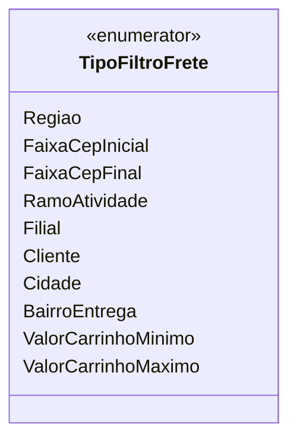

# TipoFiltroFrete
**Namespace**: IsthmusWinthor.Dominio.Enumeradores  
**Nome do Arquivo**: TipoFiltroFrete.cs  

O enum `TipoFiltroFrete` é utilizado para definir os diferentes tipos de filtros que podem ser aplicados na busca de fretes. Essa categoria de informação permite que o sistema adapte suas operações de logística, oferecendo flexibilidade nas opções de filtragem conforme a necessidade do negócio.

## Tipos Auxiliares e Dependências
- **Enumeradores**:
  - [TipoFiltroFrete](TipoFiltroFrete.md) - Enumeração que lista os tipos de filtros de frete.

## Diagrama de Relacionamentos

Este diagrama ilustra a estrutura do enumerador `TipoFiltroFrete`, que categoriza os tipos de filtro possíveis para utilização no sistema de fretes. 
---
Gerada em 29/12/2025 21:03:59
