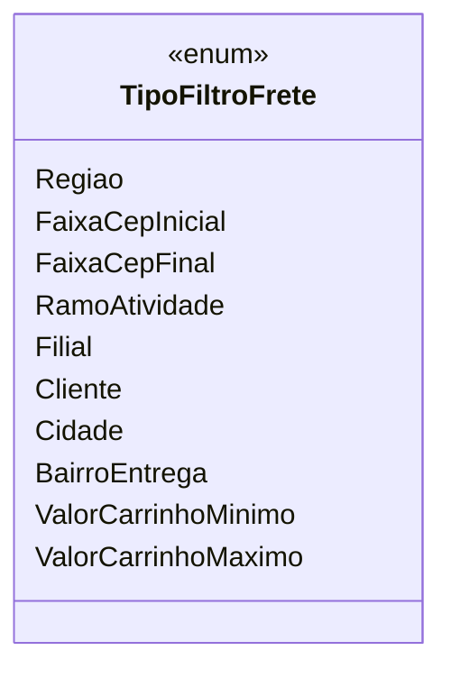

# TipoFiltroFrete
**Namespace**: IsthmusWinthor.Dominio.Enumeradores  
**Nome do Arquivo**: TipoFiltroFrete.cs  

O `TipoFiltroFrete` é um enumerador que define os diferentes tipos de filtros que podem ser aplicados para o cálculo ou a apresentação de informações relacionadas a fretes. Cada valor do enumerador representa um critério específico que auxilia na segmentação e identificação de fretes aplicáveis em uma operação de logística ou e-commerce.

## Tipos Auxiliares e Dependências
- Não existem classes complexas ou propriedades que possuam lógica de negócio ou validação a serem listadas nesta classe.
- Enumeradores utilizados: 
  - `TipoFiltroFrete`

## Diagrama de Relacionamentos

