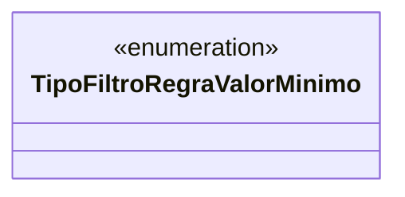

# TipoFiltroRegraValorMinimo
**Namespace**: IsthmusWinthor.Dominio.Enumeradores  
**Nome do Arquivo**: TipoFiltroRegraValorMinimo.cs  

### Visão Geral e Responsabilidade
A enumeração `TipoFiltroRegraValorMinimo` define um conjunto de constantes que representam diferentes categorias de filtros utilizados nas regras de negócio de valor mínimo. Este modelo é essencial para garantir a flexibilidade e a clareza na aplicação de filtros durante o processo de tomada de decisão, permitindo que o sistema trate diversas condições de forma coerente.

### Tipos Auxiliares e Dependências
- **Enumeradores**:
  - [TipoFiltroRegraValorMinimo](TipoFiltroRegraValorMinimo.md)

### Diagrama de Relacionamentos

### Observações
Esta enumeração serve como um ponto de referência estruturado para os filtros, facilitando a extensão futura do sistema, adicionando novos tipos de filtro conforme necessário sem impactar os componentes existentes.
---
Gerada em 29/12/2025 21:04:05
