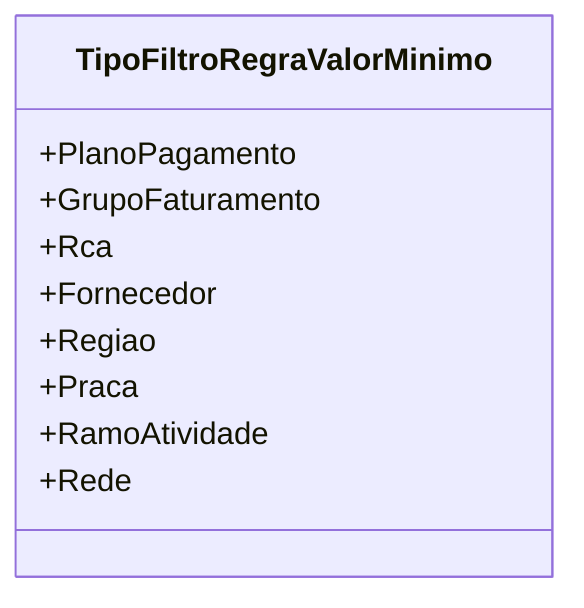

# TipoFiltroRegraValorMinimo
**Namespace**: IsthmusWinthor.Dominio.Enumeradores  
**Nome do Arquivo**: TipoFiltroRegraValorMinimo.cs  

## Visão Geral e Responsabilidade
O enum `TipoFiltroRegraValorMinimo` define os diferentes tipos de filtros que podem ser aplicados na determinação de regras de valor mínimo dentro do domínio do sistema. Esta definição é crucial para a aplicação de lógica de negócio, garantindo que os valores sejam filtrados e validados adequadamente conforme as regras específicas do contexto corporativo. A responsabilidade deste enum é centralizar e padronizar as opções de filtro, permitindo um código mais legível e evitando o uso de números mágicos.

## Tipos Auxiliares e Dependências
- Nenhum

## Diagrama de Relacionamentos

